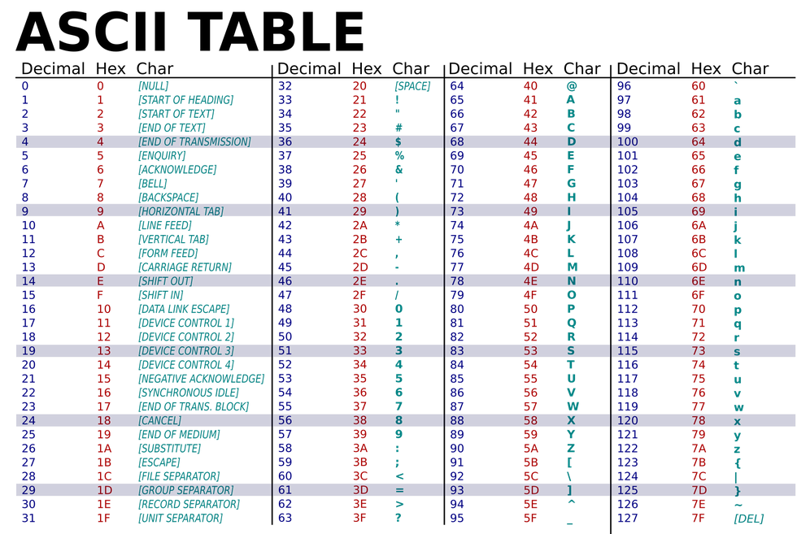

Great question: 0Ah. what is it?

The important thing to realize is that **`0Ah` is not inherently a line feed**. It's just the number **10**.

The reason it means "Line Feed" is because of the **ASCII standard**.

---

## Step 1: `0Ah` is just a number

Hexadecimal:

```text
0Ah
```

Decimal:

```text
10
```

Binary:

```text
00001010
```

By itself, it's **just the value 10**.

---

## Step 2: ASCII gives meanings to numbers

ASCII is simply a table that says:

| Decimal | Hex | Meaning              |
| ------: | --: | -------------------- |
|      65 | 41h | A                    |
|      66 | 42h | B                    |
|      67 | 43h | C                    |
|     ... | ... | ...                  |
|      10 | 0Ah | Line Feed (LF)       |
|      13 | 0Dh | Carriage Return (CR) |




So when a program sees the byte `0Ah` **as an ASCII control character**, it interprets it as **"move to the next line."**

Just like:

```text
41h → 'A'
42h → 'B'
```

Similarly,

```text
0Ah → Line Feed
```

---

## Step 3: Why "Line Feed"?

This comes from **old typewriters**.

Imagine a typewriter.

```
HELLO|
```

The `|` is the typing position.

A **Line Feed (LF)** moves the paper **up one line** (or equivalently, moves the typing position **down one line**), but **doesn't move left**.

After LF:

```text
HELLO
     |
```

Notice the cursor is now **below the previous line**, but still in the same column.

---

## Step 4: Then what is Carriage Return (`0Dh`)?

On a typewriter, the "carriage" is the part holding the paper.

A **Carriage Return (CR)** moves it back to the **left margin**.

Before CR:

```text
HELLO|
```

After CR:

```text
|HELLO
```

Same line, but back to the beginning.

---

## Step 5: Why do we often need both?

Suppose you print:

```text
HELLO|
```

Now send:

1. `LF` (`0Ah`)

```text
HELLO
     |
```

2. `CR` (`0Dh`)

```text
HELLO
|
```

Now the cursor is at the **beginning of the next line**, exactly what we expect after pressing **Enter**.

---

## Step 6: Modern languages hide this

In C:

```c
printf("Hello\nWorld");
```

You write `\n`, but behind the scenes the terminal may interpret it as a newline. On older DOS systems, a proper new line was often represented by the pair:

```text
0Dh 0Ah
```

which is **Carriage Return + Line Feed**.

---

### The key idea

`0Ah` is **not magically** a line feed.

It's simply the byte value **10**, and the **ASCII standard** assigns that byte the meaning **"Line Feed"**, just as it assigns:

* `41h` → `'A'`
* `30h` → `'0'`
* `20h` → space
* `0Ah` → Line Feed
* `0Dh` → Carriage Return
